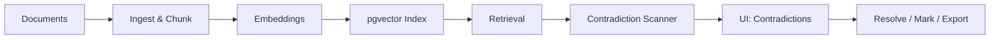

# VeriDoc

🎯 **VeriDoc — Enterprise Knowledge Truth Engine**

VeriDoc helps teams keep a single source of truth across documentation at scale. It automatically ingests documents, builds semantic search indexes, and runs contradiction scans that surface conflicting statements, rank their severity, and link back to original sources so reviewers can act quickly.

✨ Why this matters

- Organizations accumulate policies, handbooks, and operational documents across teams and time. Human review is slow — VeriDoc accelerates discovery of contradictions, outdated policies, and risky divergence so you can remediate confidently.
- The system prioritizes signals by severity, confidence, and impact so reviewers focus on what matters.

🚀 Highlights / What VeriDoc does

- 🔎 Semantic search across documents using embeddings + pgvector
- ⚠️ Contradiction detection with ranked severity and provenance
- 🔗 Source attribution: show the exact document chunk and context
- ✅ One-click resolve actions and reviewer workflows
- 🎯 Targeted scans for subsets or single documents
- 🔌 Extensible model layer: swap embeddings/generation backends

📦 Primary use cases

- Compliance audits — find conflicting policy language before an external review
- Knowledge consolidation — detect duplicate or contradictory guidance across teams
- Product documentation QA — surface outdated or inconsistent engineering docs

🧭 Architecture & Tech Stack (high-level)

- Backend: `FastAPI` (Python) — ingestion, scan orchestration, API
- Frontend: `Next.js` (React + TypeScript) — interactive UI, scan controls
- Embeddings: Google embeddings (configurable) — vectorize text
- Vector store: Supabase `pgvector` — fast semantic retrieval + metadata
- Storage/metadata: Supabase (Postgres)
- Parsers: `PyMuPDF`, `python-docx` for document extraction



🗂 Project layout (short)

```
.
├── backend/      # FastAPI service: ingestion, embedding, scan jobs, Supabase
├── frontend/     # Next.js app: upload, scan UI, contradictions, reviewer flows
├── ACTION_ITEMS.md
├── INTEGRATION_COMPLETE.md
├── QUICK_START.md
└── README.md     # This file (overview + links)
```

📚 Where to find detailed run & setup instructions

- Backend setup and API docs: [backend/README.md](backend/README.md)
- Frontend setup and environment notes: [frontend/README.md](frontend/README.md)

🔐 Environment & secrets

- Keep secret config out of source control. Use `.env` / `.env.example` and platform env variables for deploys.
- Local-only files like `frontend/.env.local` are ignored; if previously committed, remove them from the index and consider rotating keys.

🤝 Contributing

- Found a bug or want a feature? Open an issue describing the dataset and steps to reproduce.
- For code contributions, fork, create a feature branch, and open a PR with tests and a short description.

📬 Need help or want a walkthrough?

- Ping the maintainers or open an issue — I can also prepare architecture diagrams or a short video walkthrough on request.

---

Would you like more visual polish (SVG badges, animated diagrams), or shall I add a short

